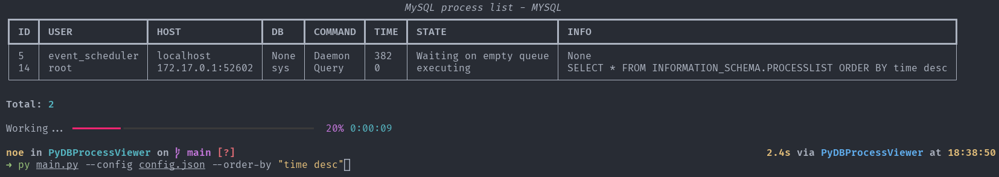

# PyDBProcessViewer


Monitor de Procesos MySQL en Terminal: este script se conecta al servidor MySQL especificado en un archivo JSON y genera una tabla en la terminal que lista los procesos actuales de la base de datos, actualizando la información cada cierto tiempo.

# Uso

Cree el entorno virtual e instale las dependencias:

```bash
python3 -m venv venv
source venv/bin/activate
pip3 install -r requirements.txt
```

Necesita crear un archivo con la configuración del servidor MYSQL, por ejemplo:

```json
{
  "host":"127.0.0.1",
  "username":"",
  "password": "",
  "database": "",
  "port": 3306
}
```

Ahora ejecute el archivo main.py con la opción --config y el archivo JSON:

```bash
python3 main.py --config config.json
```

Para ver todas las opciones disponibles:

```bash
python3 main.py -h
```

# Capturas de pantalla





