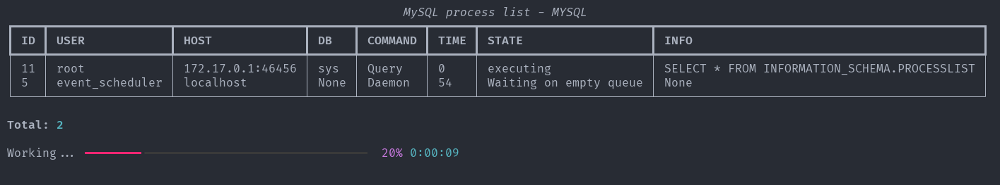
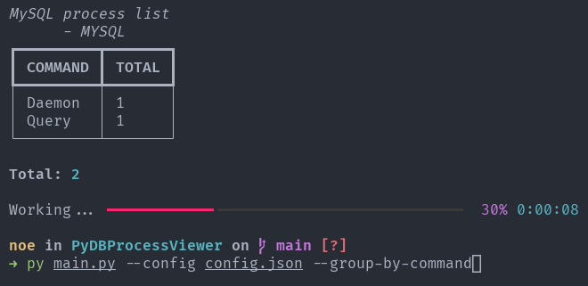

# PyDBProcessViewer



MySQL Process Monitor in Terminal: this script connects to the MySQL server specified in a JSON file and generates a table in the terminal that lists the current processes in the database, updating the information from time to time.

# Usage

Create the virtual environment and install the dependencies:

```bash
python3 -m venv venv
source venv/bin/activate
pip3 install -r requirements.txt
```

You need to create a file with the MYSQL server configuration, for example:

```json
{
  "host":"127.0.0.1",
  "username":"",
  "password": "",
  "database": "",
  "port": 3306
}
```

Now run the main.py file with the --config option and the JSON file:

```bash
python3 main.py --config config.json
```

To see all available options:

```bash
python3 main.py -h
```

# screenshots



